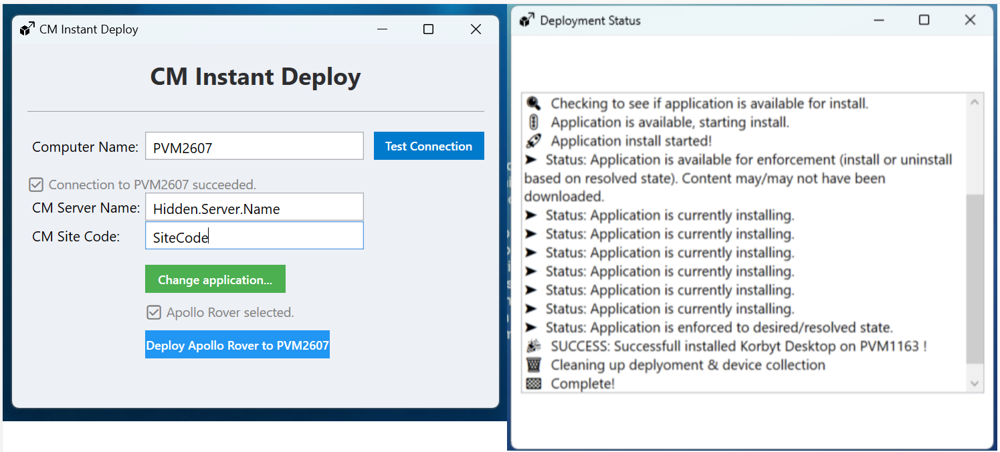

# CM-Instant-Deploy
A tool I have made if I need to deploy a specific application to a specific workstation in real time. 

##

## Requirements
Must have administrative rights to workstations. 
 
Must have access to CM server (done through an invoke-wmi)
